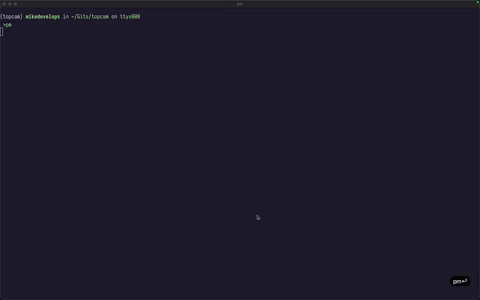

# Example

# Table of Contents
- [What's It For?](#Whats-It-For)
- [Keymaps](#Keymaps)
    - [Mode Keymap](#Mode-Keymap)
    - [Window Movement Keymap](#Window-Movement-Keymap)
    - [Frame Movement Keymap](#Frame-Movement-Keymap)
    - [Sizing Keymap](#Sizing-Keymap)

# What's It For?
This program uses your main camera to create a virtual window that you can move around and resize.

Personally, I use it to connect to my iPhone's camera and use it as a webcam (which is a lot better than the built-in one).

It makes benefit of the new MacOS feature (currently only available in the beta version).

# Keymaps
## Mode Keymap
- P: Toggle Portrait Mode
- L: Toggle Landscape Mode
- R: Toggle Reverse Mode
- G: Toggle Guide Window

## Window Movement Keymap
- H/A: Move Left
- J/S: Move Down
- K/W: Move Up
- L/D: Move Right

## Frame Movement Keymap
- Shift + H/A: Move Left
- Shift + J/S: Move Down
- Shift + K/W: Move Up
- Shift + L/D: Move Right

## Sizing Keymap
- Shift + I/Q: Zoom In
- Shift + O/E: Zoom Out
- I/Q: Zoom In
- O/E: Zoom Out
- F: Toggle Fullscreen